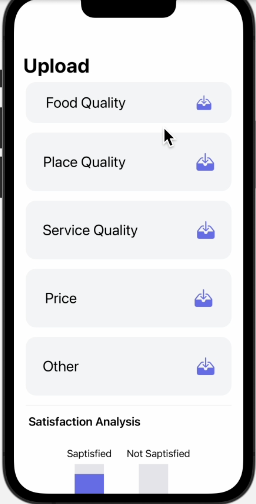
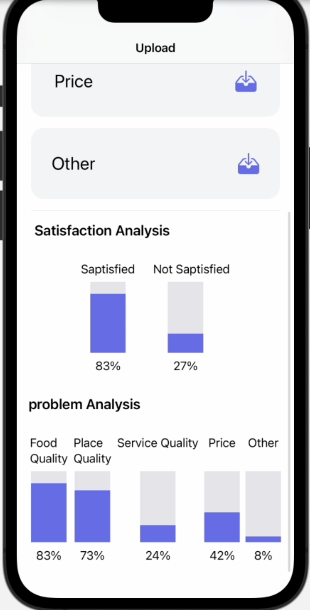

# Reco – AI-Powered Intelligent Request Routing System

## Overview

Reco is an AI-powered orchestration layer designed to transform incoming data into structured operational actions across enterprise environments.

By leveraging advanced intelligence through the ChatGPT API, Reco introduces a dynamic decision engine that seamlessly aligns incoming signals with the internal workflow architecture of an organization.

---

## 📸 Screenshots

---

## 🎥 Demo

A quick demonstration of how Reco intelligently processes and routes requests:

👉 [Watch Reco in Action](./reco.mov)

---

## Problem Statement

Organizations often face delays and inefficiencies due to:

* Misrouted requests
* Manual triaging of data
* High operational overhead
* Slow response times

---

## Solution

Reco introduces an intelligent decision engine that:

* Interprets incoming data using AI
* Determines the most relevant operational path
* Routes requests automatically
* Ensures each issue reaches the appropriate owner efficiently

---

## Key Features

* AI-powered intelligent routing using ChatGPT API
* Automated request-to-department mapping
* Reduces human error in task assignment
* Improves operational efficiency and response time
* Scalable for enterprise-level environments

---

## System Workflow

1. Input data or request is received
2. Data is structured and processed
3. Sent to ChatGPT API for analysis
4. AI determines the most relevant category/department
5. Request is routed to the correct database/handler
6. Output is organized and ready for action

---

## Technologies Used

* Java
* ChatGPT API (OpenAI)
* Database Processing

---

## Business Impact

* Faster issue resolution
* Reduced workload on operations teams
* Improved service quality
* Better resource utilization
* Supports digital transformation initiatives

---

## Hackathon Achievement

Developed as part of the ChatGPT Hackathon and selected among the **Top 15 projects**, highlighting its innovation and real-world business value.

---

## Use Cases

* Customer support ticket routing
* Internal request management systems
* Complaint classification and handling
* Enterprise workflow automation

---

## Future Enhancements

* Real-time integration with enterprise systems
* Dashboard for monitoring and analytics
* Multi-language support
* Advanced AI tuning for higher accuracy

---

## Team

Stratus

---

## Project Name

Reco
